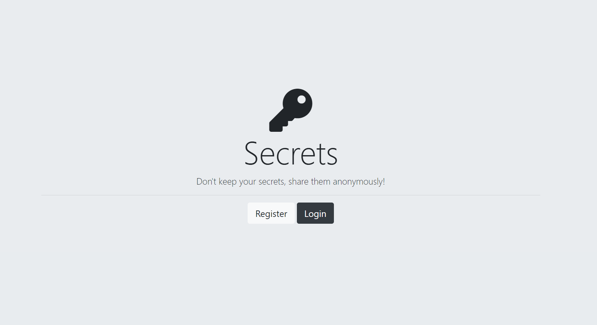
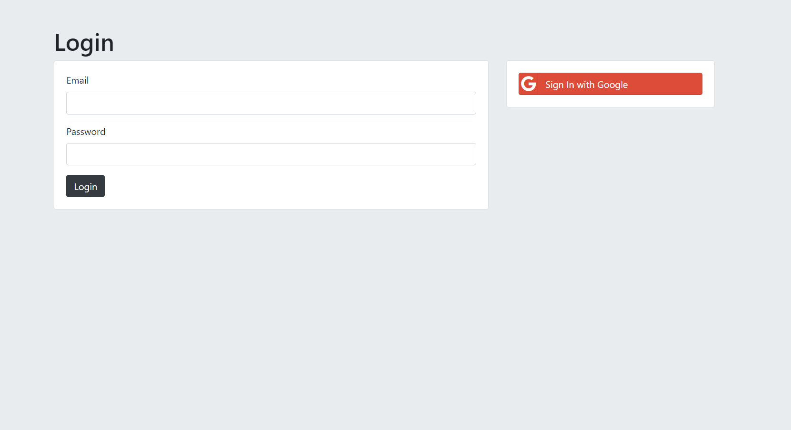
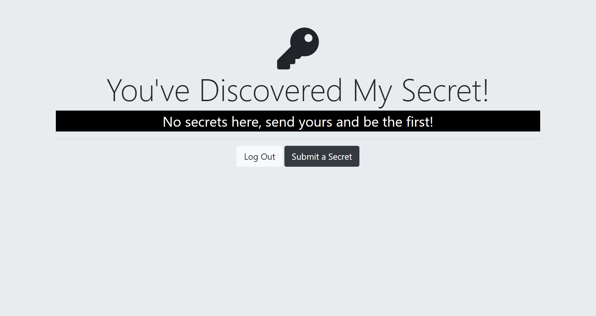

# Secrets App - Auth Security Sample

An app for learning purposes. Along the commits, you'll find these different levels of authentication & security codes:

* Level 1: Username and password only
* Level 2: Encryption
* Level 3: Hashing passwords
* Level 4: Salting and hashing passwords with bcrypt
* Level 5: Using passport.js to add cookies and sessions
* Level 6: OAuth 2.0 & implement sign in with google

**How to use:** 
1. Make a clone for your local repository
2. Inside project root folder path, type this in terminal: 'node app.js' or 'nodemon app.js' (the server will start on PORT 3000)
    * If you need to install nodemon, [click here](https://www.npmjs.com/package/nodemon) and follow the steps
3. Open any browser and type 'localhost:3000'
4. Type 'Ctrl + C' in terminal to stop the server.

*Hope you enjoy it* 🙃  
*Feel free to open an issue or PR and contribute with the project* ❤️ 

**External dependencies used in this project:**
    - "body-parser": "^1.20.2",
    - "dotenv": "^16.3.1",
    - "ejs": "^3.1.9",
    - "express": "^4.18.2",
    - "express-session": "^1.17.3",
    - "mongoose": "^8.0.3",
    - "mongoose-findorcreate": "^4.0.0",
    - "passport": "^0.7.0",
    - "passport-google-oauth20": "^2.0.0",
    - "passport-local": "^1.0.0",
    - "passport-local-mongoose": "^8.0.0"